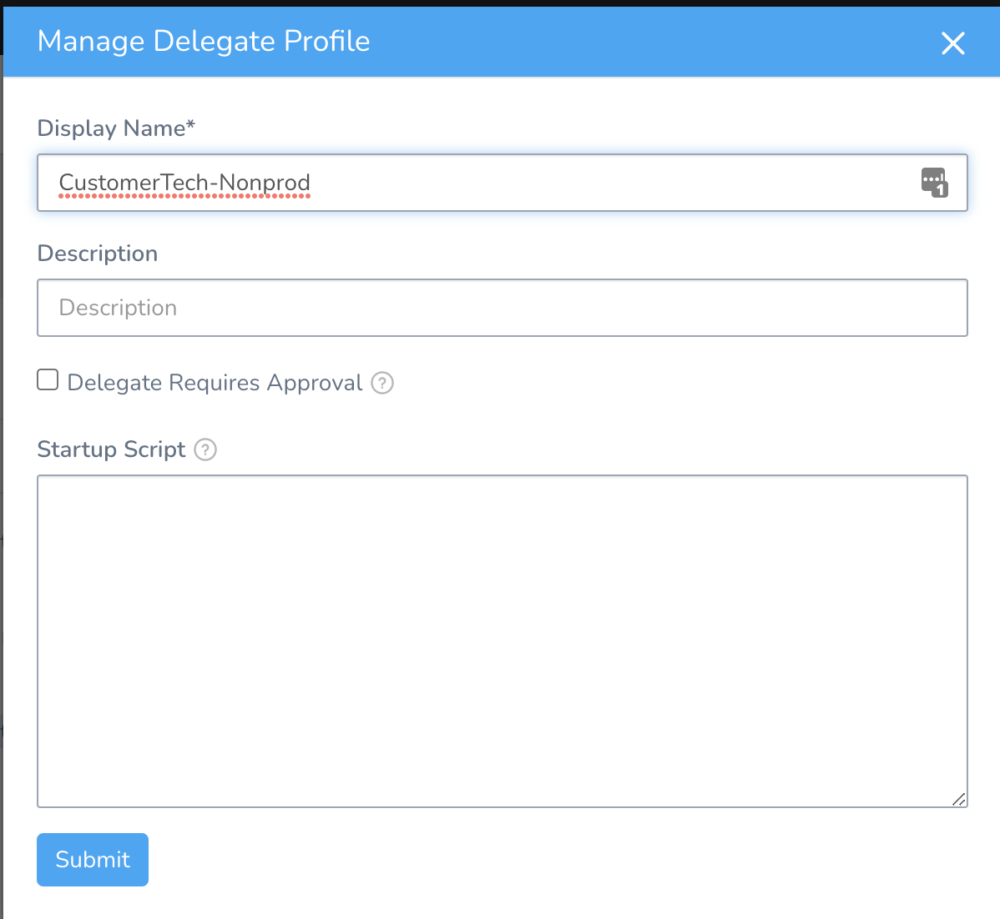
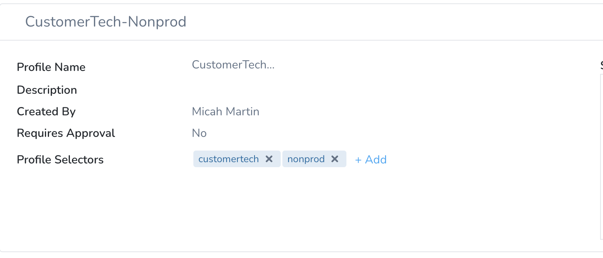
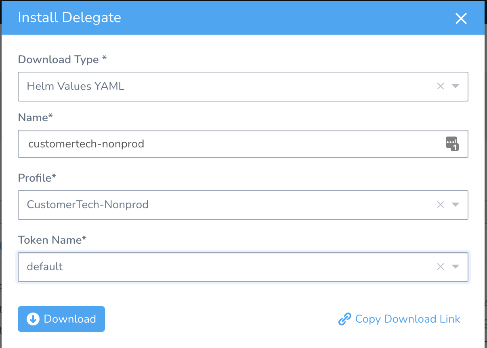
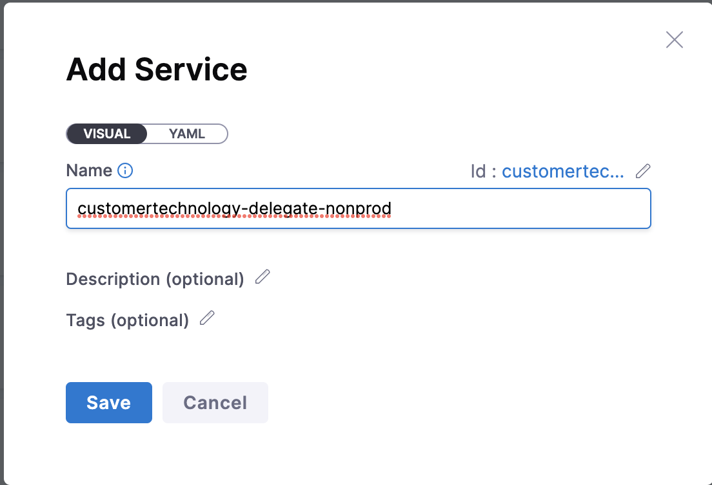
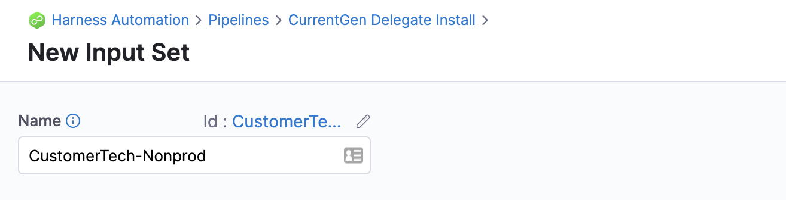
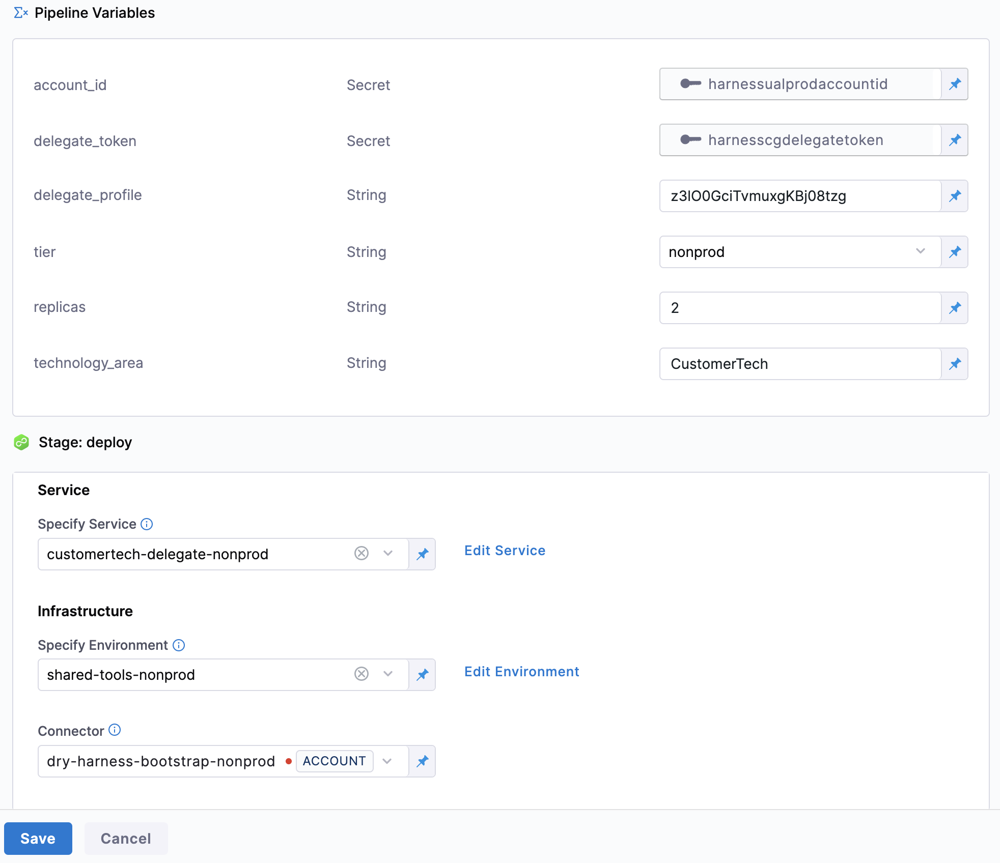
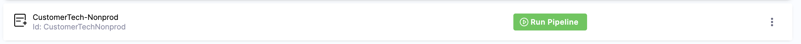

# Delegate Installation

This document outlines the process for installing delegates for a specific technology area. For each technology area there will be separate delegates for prod and nonprod deployments. 

## Installing Current Gen Delegates

### Create new delegate profiles

Navigate to [Setup -> Harness Delegates -> Delegate Profiles](https://app.harness.io/#/account/H6rHO8vtQYKelD_wgjnMpA/delegates?activeTab=delegate-profiles-tab) and create two new delegate profiles called `<Technology_Area>-<Tier>` where `Tier` is either `Prod` or `Nonprod`.

Once they're created click the `+Add` next to the `Profile Selecors` and add the selectors `<technology_area>` and `<tier>`. **Ensure these are both lower case**. This is an essential component for when the Cloud Providers are configured to make sure the proper delegates are selected.

### Get the delegate details

From the delegate list page, click the `Install Delegate` button and fill out the form accordingly.

Click the `Download` button and open the `harness-delegate-values.yaml`. We will need to capture the `delegateProfile` value from this file. 

### Create a service

Create a new service in the [Harness Automation project](https://app.harness.io/ng/#/account/H6rHO8vtQYKelD_wgjnMpA/cd/orgs/default/projects/Harness_Automation/services) called `<technology_area>-delegate-<tier>`. 

### Setup pipeline Input Set

Open up the [Delegate Install pipeline](https://app.harness.io/ng/#/account/H6rHO8vtQYKelD_wgjnMpA/cd/orgs/default/projects/Harness_Automation/pipelines/CurrentGen_Delegate_Install/input-sets) and add a new Input set.

Set all of the configuration according to this screenshot.

Be sure and select the right environment and connector based on whether the delegate is `prod` or `nonprod`.

Once this is complete you can click the `Run Pipeline` from from the newly created Input Set.

